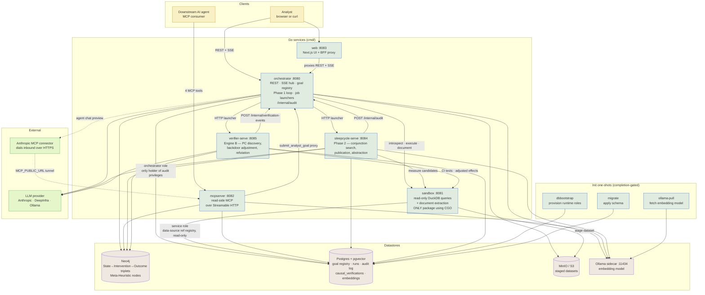

# Architecture

The components, the boundaries between them, and which of them may touch which datastore. For what
the system *does*, start at [How it works](../README.md#how-it-works); for the runtime sequence, see
[the discovery flow](discovery-flow.md).

## Reading the diagram

**The Sandbox is the only measurement surface.** Every number in the graph — Phase-1 triplet values,
Phase-2 candidate measurements, Engine B's naive and adjusted effects — comes back from a read-only
DuckDB query the Sandbox ran. It is also the only package that links DuckDB, so it is the only one
that needs CGO; every other service reaches it through `internal/sandboxclient`, which carries its
own copy of the wire contract. Callers must not import `internal/sandbox`.

**Two services write, three mostly read.** The Orchestrator and the Sleep-Cycle Worker are the only
writers of triplets and Meta-Heuristics; the Verifier writes verification records and graph
versions. The MCP server writes nothing of its own — goal registration is proxied to the
Orchestrator so intake validation cannot fork.

**Postgres access is role-split.** The Orchestrator authenticates as its own role and is the only
one with audit-table privileges, which is why the Sleep-Cycle Worker and the Verifier record through
`POST /internal/audit` rather than writing the table. Everything else uses the shared service role;
the Sandbox's is read-only and exists only to validate data-source refs.

**The launchers are a seam, not a coupling.** `SLEEPCYCLE_WORKER_URL` and `VERIFIER_WORKER_URL`
select an HTTP launcher; unset, the same code path runs the worker as a one-shot batch job
(`make sleep-cycle`, `make discover`). The Orchestrator dispatches the same arguments either way.

**The agent chat preview inverts the direction of every other edge.** Anthropic's infrastructure
dials the MCP server from outside the network, so it needs a public HTTPS URL — the dashed edges.
Unconfigured, that path is inert and nothing else is affected.

**Storage is split three ways with no shared transaction.** A Meta-Heuristic node in Neo4j and its
embedding in pgvector are written separately, which is the cross-store consistency item on the
[roadmap](../README.md#in-flight).
