# Discovery flow

One objective from submission to published Meta-Heuristics, and how that published corpus reaches
the *next* objective. For the components each step runs in, see [Architecture](architecture.md).

```mermaid
flowchart TB
  classDef human fill:#d2992222,stroke:#d29922,stroke-width:1px
  classDef measure fill:#1f6feb22,stroke:#1f6feb,stroke-width:1px
  classDef model fill:#3fb95022,stroke:#3fb950,stroke-width:1px
  classDef corpus fill:#8957e522,stroke:#8957e5,stroke-width:1px
  classDef gate fill:#f8514922,stroke:#f85149,stroke-width:1px

  start(["Analyst: goal text in plain English<br/>+ a .csv / .parquet / .pdf<br/>+ optional entity_key_column & time_column"]):::human

  subgraph Intake["Intake — POST /goals (synchronous, 201 or 4xx)"]
    ingest["Ingest file into object store"]
    introspect["Introspect schema<br/>via Sandbox"]
    fit["Claude fits the Evaluation Matrix:<br/>aggregation + value expression + direction"]:::model
    dry["Dry-run the fitted objective<br/>against the Sandbox"]:::measure
    track{"Classify track"}
    persist["Persist goal → optimization_function_id"]
  end

  subgraph P1["Phase 1 — Active Hypothesis Loop (POST /goals/{id}/hypothesis-loop)"]
    pin["Pin objective from the matrix"]
    baseline1["Measure root baseline,<br/>no filters"]:::measure
    propose["Claude proposes candidate<br/>filter predicates"]:::model
    meas1["Measure candidate at its<br/>CUMULATIVE filter set<br/>(own + every ancestor's)"]:::measure
    write1["Write State → Intervention → Outcome<br/>triplet to Neo4j<br/>effect = value − PARENT's value"]
    improved{"Beats parent<br/>AND clears hard constraints?"}:::gate
    deeper["Expand: fresh proposal one level down<br/>depth-first, to the depth cap"]
    stop["Recorded, not expanded<br/>— still eligible for Phase 2"]
    sse(["SSE frames: triplet · branch_failure ·<br/>confidence_distribution · loop_complete"])
  end

  subgraph EB["Engine B — causal verification (asynchronous)"]
    promote["Auto-promote top-N findings,<br/>ranked by support-shrunk delta<br/>(charged to the per-goal budget)"]
    claimv["verify-track goal's own claim<br/>(exempt from budget & kill switch)"]
    ondemand(["Analyst / MCP verify_finding<br/>(exempt from budget)"]):::human
    discover["Discover causal graph by<br/>conditional-independence testing"]:::measure
    adjust["Recompute effect with<br/>backdoor adjustment"]:::measure
    refute["Refutation battery: placebo,<br/>subsample, random confounder"]:::measure
    verdict(["causally_verified · confounded ·<br/>not_identifiable"])
    correct(["Analyst corrects an edge →<br/>new graph version, stale verifications re-run"]):::human
  end

  subgraph P2["Phase 2 — Sleep Cycle (POST /goals/{id}/sleep-cycle)"]
    settle["Settle prior run: staleness sweep,<br/>re-embed pending"]
    baseline2["Measure GLOBAL unfiltered baseline<br/>— the reference for every derived effect"]:::measure
    sstar["Load eligible findings, pick S*<br/>= best raw objective value any achieved"]
    vocab["Build atom vocabulary<br/>= every distinct predicate the findings introduced<br/>(+ optional schema-derived atoms)"]
    ground["Ground retrieved Meta-Heuristics into<br/>THIS data source's columns"]:::model
    search["Search the conjunction lattice<br/>PUCT (default) or beam<br/>Apriori support pruning throughout"]
    meas2["Measure every surviving candidate<br/>— objective + row count in one query"]:::measure
    better{"Materially better than S*<br/>by MIN_LIFT?"}:::gate
    winners["Write back as full triplets vs.<br/>the global baseline, sleep-derived,<br/>deterministic ids"]
    select["Select publications over the UNION of<br/>Phase-1 findings + derived winners:<br/>dedupe → support-shrunk rank →<br/>drop restatements → cap"]
    abstract["Claude abstracts each selection into a<br/>domain-agnostic Meta-Heuristic"]:::model
  end

  subgraph Corpus["The corpus — cross-goal, cross-dataset"]
    mh[("Meta-Heuristic nodes in Neo4j<br/>linked back to supporting triplets")]:::corpus
    vec[("Embeddings in pgvector")]:::corpus
  end

  subgraph Next["A SUBSEQUENT objective — same intake, same phases"]
    goal2(["New goal, possibly a different dataset"]):::human
    retrieve["Phase 2 retrieval: embed the goal text,<br/>similarity-search the corpus (k = RETRIEVAL_K)"]
    adopt["Adopt whole conjunctions at the root<br/>— GROUNDING_FRACTION of its expansions,<br/>retrieval similarity as the PUCT prior"]
    weight["Verified effects multiply a<br/>candidate's value estimate"]
  end

  consumers(["Consumers: GET /heuristics/search · /trace ·<br/>MCP get_optimized_heuristics · trace_causal_chain<br/>— each result carries its epistemic_source"]):::human

  start --> ingest --> introspect --> fit --> dry
  dry -->|compiles| track
  dry -->|"does not compile → 4xx,<br/>after up to 3 schema-aware repairs"| start
  track -->|"explore"| persist
  track -->|"verify — claim extracted & grounded"| persist
  persist --> pin

  pin --> baseline1 --> propose --> meas1 --> write1 --> improved
  improved -->|yes| deeper --> meas1
  improved -->|no| stop
  write1 -.-> sse

  write1 --> promote
  persist -.->|verify track| claimv
  promote --> discover
  claimv --> discover
  ondemand --> discover
  discover --> adjust --> refute --> verdict
  correct -.-> discover

  write1 --> settle
  stop --> settle
  settle --> baseline2 --> sstar --> vocab --> search
  vocab --> ground --> search
  search --> meas2 --> better
  better -->|yes| winners --> select
  better -->|"no — a run that writes back<br/>nothing still publishes"| select
  sstar --> select
  select --> abstract --> mh
  abstract --> vec

  mh --> consumers
  vec --> consumers

  goal2 --> retrieve
  vec -.->|"similarity search,<br/>CROSS-GOAL by default"| retrieve
  mh -.->|"hydrate node + its<br/>source conjunctions"| retrieve
  retrieve --> adopt --> goal2
  verdict -.->|"causal multiplier"| weight --> goal2
  goal2 -.->|"its own publications<br/>rejoin the corpus"| mh
```

## The three things worth reading twice

**Effect size means two different things on the two phases.** A Phase-1 triplet's effect is
*parent-relative* — the marginal contribution of its newest predicate. A Phase-2 winner's is
measured against the *global unfiltered baseline*. Comparing one to the other directly is a
category error.

**Pruned is not discarded.** The triplet is written before the improve check, so a candidate that
fails to beat its parent is still measured, still recorded, and still feeds Phase 2's atom
vocabulary. That is why the `stop` branch flows into the Sleep Cycle alongside the expanded ones,
and why triplet count exceeds expanded-node count.

**The two Phase-2 gates are deliberately separate.** `MIN_LIFT` gates write-back only. A bar phrased
relative to `S*` gets harder to clear the better Phase 1 performed, so letting it also gate
publication would mean a strong Phase 1 silently suppresses the goal's knowledge output. A run that
writes back zero macro-segments can still publish.

## How a prior heuristic reaches a new objective

The dashed edges out of the corpus are the reuse path, and it runs entirely inside a *subsequent*
goal's Phase 2:

1. **Retrieve.** The new goal's text is embedded and similarity-searched against the corpus. The
   search is cross-goal by default — that is the entire point, since a heuristic abstracted from
   this goal's own findings describes a segment the atom search already reaches.
   `SLEEPCYCLE_SEARCH_CROSS_GOAL_GROUNDING=false` narrows it back to one goal and leaves the path
   inert.
2. **Instantiate.** A Meta-Heuristic is stated in a domain-agnostic vocabulary, so it has to be
   recovered in the new data source's own columns. A heuristic abstracted from *this same* data
   source needs no model call — its source conjunctions are already written in these columns.
   Anything else goes through a grounding call, the only way to map bracketed terms onto columns the
   model has never seen. Each hit contributes at most three conjunctions, so one strong match cannot
   crowd out the rest.
3. **Adopt.** Surviving conjunctions enter the search as whole moves at the root, competing for
   `SLEEPCYCLE_SEARCH_GROUNDING_FRACTION` of its expansions, with retrieval similarity as the PUCT
   prior. Separately, a candidate resting on a causally verified effect has its value estimate
   multiplied, so verified knowledge outranks mere correlation.

Both inputs are strictly additive: with an empty corpus and no verified edges, the search degrades
to plain UCT over the goal's own atoms. Nothing about a first run depends on them.
